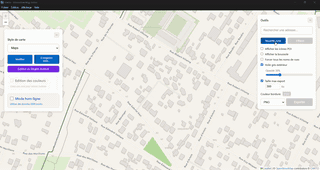

# Carto - Éditeur de Cartes Interactif

Application de bureau multiplateforme pour l'édition de cartes interactives avec des données OpenStreetMap et l'export SVG haute qualité.

### Aperçu de l'application



## Fonctionnalités

- **Sélection de zone polygonale** : Dessinez des zones, ajustez les points, arrondissez les angles
- **Export multi-format** : SVG (vectoriel), PNG (image), PDF (document)
- **Système de règles personnalisées** : Éditeur avancé de règles basé sur les tags OSM avec conditions imbriquées
- **Rulesets prédéfinis** : Default, Minimal, Detailed avec possibilité d'import/export (.mrules)
- **Valeurs dépendantes du zoom** : Couleurs et largeurs adaptées au niveau de zoom
- **Thèmes personnalisables** : Styles Maps, OpenStreetMap, ou personnalisés (legacy)
- **Personnalisation des polices** : Choix de la police et option gras pour les labels
- **Recherche d'adresses** : Localisez et centrez la carte sur une adresse (Nominatim)
- **Mode hors-ligne** : Chargez des fichiers .osm locaux pour travailler sans connexion
- **Panneaux réductibles** : Minimisez les panneaux pour plus d'espace carte
- **Mises à jour automatiques** : Vérification et téléchargement des mises à jour depuis GitHub
- **Données OSM complètes** : Routes, bâtiments, parcs, cours d'eau, POIs, zones...
- **Noms de rues intelligents** : Abréviations automatiques (Rue → r., Avenue → av., etc.)
- **Multiplateforme** : Windows, macOS et Linux

---

## Installation

### Télécharger les binaires (recommandé)

Téléchargez la dernière version depuis la page [Releases](../../releases) :

| Plateforme | Fichier | Instructions |
|------------|---------|--------------|
| **Windows** | `Carto-X.X.X.exe` | Double-cliquez pour lancer (portable, pas d'installation) |
| **Windows** | `Carto-X.X.X-win.zip` | Décompressez et lancez `Carto.exe` |
| **macOS** | `Carto-X.X.X-mac.zip` | Décompressez, glissez `Carto.app` dans Applications |
| **Linux** | `Carto-X.X.X.AppImage` | `chmod +x` puis exécutez |

#### Notes d'installation

**Windows** : Au premier lancement, Windows Defender peut afficher un avertissement. Cliquez sur "Plus d'infos" → "Exécuter quand même".

**macOS** : Si macOS bloque l'app, allez dans Préférences Système → Sécurité et confidentialité → "Ouvrir quand même".

**Linux** :
```bash
chmod +x Carto-*.AppImage
./Carto-*.AppImage
```

---

## Utilisation

### Navigation sur la carte

| Action | Commande |
|--------|----------|
| Déplacer la carte | Glisser avec la souris |
| Zoomer/Dézoomer | Molette de la souris |
| Rechercher une adresse | Barre de recherche en haut à droite |

### Dessiner une zone

1. Cliquez sur **"Nouvelle zone"**
2. Cliquez sur la carte pour ajouter des points
3. Maintenez **Ctrl** pour déplacer la carte pendant le dessin
4. Cliquez sur le **point vert** (premier point) pour fermer le polygone
5. **Ajustez les points** : glissez-déposez les marqueurs bleus pour modifier la forme
6. **Ajouter un point** : double-cliquez sur une ligne du polygone
7. **Supprimer un point** : double-cliquez sur un marqueur (minimum 3 points)
8. **Arrondir** : Ctrl+clic sur des points consécutifs, puis cliquez sur "Arrondir"

### Personnaliser le style

#### Mode simple (StylePanel)

1. Cliquez sur **"Modifier"** dans le panneau de gauche
2. Ajustez les couleurs par catégorie :
   - Routes (autoroutes, rues, chemins...)
   - Bâtiments (résidentiels, commerciaux...)
   - Zones naturelles (eau, forêts, parcs...)
3. Personnalisez les labels :
   - **Police** : Roboto, Arial, Georgia, Times New Roman, Verdana, Courier New
   - **Gras** : Active/désactive le texte en gras
   - **Taille** : Ajustez la taille des noms de rues et zones
4. Cliquez sur **"Appliquer"** pour valider

> Les paramètres de police sont automatiquement sauvegardés et restaurés au prochain lancement.

#### Mode avancé (RuleEditor)

1. Cliquez sur **"Éditeur de Règles Avancé"** pour accéder au système de règles complet
2. Chargez un préréglage (Default, Minimal, Detailed) ou créez vos propres règles
3. Définissez des conditions basées sur les tags OSM
4. Appliquez des styles différents selon les catégories
5. Utilisez des valeurs dépendantes du zoom pour l'adaptation automatique
6. Exportez/importez en format .mrules

### Exporter la carte

1. Sélectionnez une zone sur la carte
2. Configurez les options d'export :
   - **Afficher les icônes POI** : Affiche/masque les icônes de points d'intérêt (restaurants, écoles, etc.)
   - **Forcer tous les noms** : Affiche tous les noms de rues même s'ils ne tiennent pas
   - **Voile gris extérieur** : Assombrit la zone hors sélection
   - **Couleur de bordure** : Couleur du contour de la zone
3. Choisissez le format d'export :
   - **SVG** : Format vectoriel, compatible Inkscape avec calques séparés
   - **PNG** : Image haute résolution (2x)
   - **PDF** : Document avec orientation automatique

---

## Raccourcis clavier

| Raccourci | Action |
|-----------|--------|
| `Ctrl` + glisser | Déplacer la carte pendant le dessin |
| `Molette` | Zoom avant/arrière |
| `Double-clic` sur ligne | Ajouter un point sur le polygone |
| `Double-clic` sur point | Supprimer le point (min. 3 points) |
| `Échap` | Annuler le dessin en cours |

---

## Menu de l'application

### Fichier
- **Quitter** : Ferme l'application

### Édition
- Annuler, Rétablir, Couper, Copier, Coller, Tout sélectionner

### Affichage
- Recharger, Outils de développement, Zoom, Plein écran

### Aide
- **Vérifier les mises à jour** : Recherche une nouvelle version sur GitHub et propose le téléchargement
- **À propos** : Affiche les informations de l'application (version, licence, auteur)

---

## Éditeur de Règles Avancé

L'éditeur de règles avancé permet un contrôle fin du rendu cartographique avec un système de règles basé sur les tags OpenStreetMap.

### Accès

Cliquez sur le bouton **"Éditeur de Règles Avancé"** dans le panneau de gauche.

### Onglets

| Onglet | Description |
|--------|-------------|
| **Préréglages** | Chargez un style prédéfini (Default, Minimal, Detailed) |
| **Features** | Définitions des éléments cartographiques (routes, bâtiments, etc.) |
| **Règles** | Propriétés de rendu pour chaque feature |
| **Importer** | Importez un fichier .mrules par drag & drop ou texte |

### Conditions de sélection

Les features sont sélectionnées selon les tags OSM :

| Opérateur | Exemple | Description |
|-----------|---------|-------------|
| `equals` | `highway = residential` | Correspond exactement |
| `not_equals` | `highway ≠ motorway` | Ne correspond pas |
| `exists` | `name *` | La clé existe (toute valeur) |
| `not_exists` | `~name` | La clé n'existe pas |
| `matches` | `name ~ .*Street.*` | Expression régulière |
| `one_of` | `highway ∈ {residential, unclassified}` | Fait partie d'une liste |

### Types de propriétés

| Type | Propriétés | Description |
|------|------------|-------------|
| **Couleurs** | `line-color`, `fill-color`, `border-color`, `text-color` | Couleurs hexadécimales avec blending optionnel |
| **Dimensions** | `line-width`, `border-width`, `font-size` | Valeurs numériques ou dépendantes du zoom |
| **Opacités** | `fill-opacity`, `line-opacity` | Valeurs de 0.0 à 1.0 |
| **Styles** | `line-style`, `border-style` | `solid`, `dash`, `dot`, `none` |

### Valeurs dépendantes du zoom

Spécifiez différentes valeurs selon le niveau de zoom :
```
z12: 1.0, z14: 2.0, z16: 3.0
```
Les valeurs intermédiaires sont interpolées automatiquement.

### Commandes de rendu

| Commande | Description |
|----------|-------------|
| `line` | Dessine le contour (routes, chemins) |
| `fill` | Remplit la surface (bâtiments, parcs) |
| `text` | Affiche les labels et noms |
| `icon` | Affiche une icône |

### Format .mrules

Le format `.mrules` est compatible avec Maperitive. Vous pouvez :
- **Exporter** vos règles avec le bouton "Exporter .mrules"
- **Importer** des fichiers .mrules existants (drag & drop ou pâte texte)
- **Éditer** les fichiers dans un éditeur de texte pour des modifications avancées
- **Partager** vos styles .mrules personnalisés

---

## Développement

### Prérequis

- Node.js v18 ou supérieur
- npm (inclus avec Node.js)

### Installation des dépendances

```bash
git clone https://github.com/YannBrrd/carto.git
cd carto
npm install
```

### Scripts disponibles

```bash
npm run dev          # Mode développement avec hot reload
npm run build        # Compile le projet
npm start            # Lance l'application compilée
npm run dist         # Crée les packages distributables
```

### Structure du projet

```
carto/
├── src/
│   ├── main/              # Processus Electron (Node.js)
│   │   ├── main.ts        # Fenêtre, IPC, fichiers
│   │   └── preload.ts     # Bridge sécurisé
│   └── renderer/          # Interface React
│       ├── components/    # Composants UI
│       ├── utils/         # Génération SVG, données OSM
│       └── presets/       # Thèmes prédéfinis
├── build/                 # Ressources de build (entitlements macOS)
├── .github/workflows/     # CI/CD GitHub Actions
└── release/               # Binaires générés
```

### Créer une release

Les builds sont automatisés via GitHub Actions :

```bash
# Créer un tag de version
git tag v1.0.0
git push origin v1.0.0
```

Une GitHub Release sera créée automatiquement avec les binaires Windows, macOS et Linux.

---

## Technologies

- **Electron** - Framework desktop multiplateforme
- **React 18** - Interface utilisateur
- **TypeScript** - Typage statique
- **Leaflet** - Cartographie interactive
- **Overpass API** - Données OpenStreetMap
- **jsPDF** - Génération de fichiers PDF
- **electron-builder** - Packaging et distribution

---

## Dépannage

### L'application ne démarre pas

```bash
npm install
npm run build
npm start
```

### Les données OSM ne chargent pas

- Vérifiez votre connexion Internet
- Zoomez davantage (niveau 15 minimum)
- L'API Overpass peut être surchargée, réessayez après quelques minutes

### Le SVG est vide ou incomplet

- Assurez-vous que la zone contient des données (routes, bâtiments)
- Essayez une zone urbaine plus dense
- Vérifiez que le zoom est suffisant

### Windows affiche un avertissement de sécurité

L'application n'est pas signée numériquement. Cliquez sur "Plus d'infos" → "Exécuter quand même".

### macOS bloque l'application

```bash
xattr -cr /Applications/Carto.app
```

Ou : Préférences Système → Sécurité → "Ouvrir quand même"

---

## Auteur

**Yann Barraud** - [@YannBrrd](https://github.com/YannBrrd)

---

## Licence

GPL-3.0 License - Voir [LICENSE](LICENSE)

© 2024-2025 Yann Barraud

---

## Remerciements

- [OpenStreetMap](https://www.openstreetmap.org/) - Données cartographiques
- [Leaflet](https://leafletjs.com/) - Bibliothèque de cartographie
- [Overpass API](https://overpass-api.de/) - Accès aux données OSM
- [CARTO](https://carto.com/) - Tuiles de fond de carte
