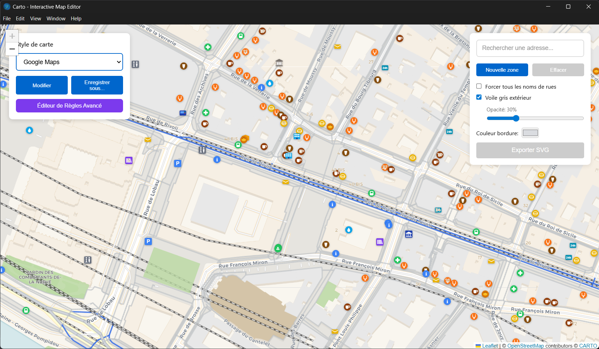

# Carto - Éditeur de Cartes Interactif

Application de bureau multiplateforme pour l'édition de cartes interactives avec des données OpenStreetMap et l'export SVG haute qualité.



## Fonctionnalités

- **Sélection de zone polygonale** : Dessinez des zones de forme libre sur la carte
- **Export SVG haute qualité** : Génère des fichiers vectoriels avec couches Inkscape
- **Thèmes personnalisables** : Styles Google Maps, OpenStreetMap, ou personnalisés
- **Données OSM** : Routes, bâtiments, parcs, cours d'eau, POIs...
- **Noms de rues intelligents** : Abréviations automatiques (Rue → r., Avenue → av., etc.)
- **Multiplateforme** : Windows, macOS et Linux

---

## Installation

### Télécharger les binaires (recommandé)

Téléchargez la dernière version depuis la page [Releases](../../releases) :

| Plateforme | Fichier | Instructions |
|------------|---------|--------------|
| **Windows** | `Carto-X.X.X.exe` | Double-cliquez pour lancer (portable, pas d'installation) |
| **Windows** | `Carto-X.X.X-win.zip` | Décompressez et lancez `Carto.exe` |
| **macOS** | `Carto-X.X.X-mac.zip` | Décompressez, glissez `Carto.app` dans Applications |
| **Linux** | `Carto-X.X.X.AppImage` | `chmod +x` puis exécutez |

#### Notes d'installation

**Windows** : Au premier lancement, Windows Defender peut afficher un avertissement. Cliquez sur "Plus d'infos" → "Exécuter quand même".

**macOS** : Si macOS bloque l'app, allez dans Préférences Système → Sécurité et confidentialité → "Ouvrir quand même".

**Linux** :
```bash
chmod +x Carto-*.AppImage
./Carto-*.AppImage
```

---

## Utilisation

### Navigation sur la carte

| Action | Commande |
|--------|----------|
| Déplacer la carte | Glisser avec la souris |
| Zoomer/Dézoomer | Molette de la souris |
| Rechercher une adresse | Barre de recherche en haut à droite |

### Dessiner une zone

1. Cliquez sur **"Nouvelle zone"**
2. Cliquez sur la carte pour ajouter des points
3. Maintenez **Ctrl** pour déplacer la carte pendant le dessin
4. Cliquez sur le **point vert** (premier point) pour fermer le polygone

### Personnaliser le style

1. Cliquez sur **"Modifier le style"** dans le panneau de gauche
2. Ajustez les couleurs par catégorie :
   - Routes (autoroutes, rues, chemins...)
   - Bâtiments (résidentiels, commerciaux...)
   - Zones naturelles (eau, forêts, parcs...)
3. Cliquez sur **"Appliquer"** pour valider

### Exporter en SVG

1. Sélectionnez une zone sur la carte
2. Configurez les options d'export :
   - **Forcer tous les noms** : Affiche tous les noms de rues même s'ils ne tiennent pas
   - **Voile gris extérieur** : Assombrit la zone hors sélection
   - **Couleur de bordure** : Couleur du contour de la zone
3. Cliquez sur **"Exporter SVG"**
4. Le fichier généré est compatible Inkscape avec des calques séparés

---

## Raccourcis clavier

| Raccourci | Action |
|-----------|--------|
| `Ctrl` + glisser | Déplacer la carte pendant le dessin |
| `Molette` | Zoom avant/arrière |
| `Échap` | Annuler le dessin en cours |

---

## Développement

### Prérequis

- Node.js v18 ou supérieur
- npm (inclus avec Node.js)

### Installation des dépendances

```bash
git clone https://github.com/YannBrrd/carto.git
cd carto
npm install
```

### Scripts disponibles

```bash
npm run dev          # Mode développement avec hot reload
npm run build        # Compile le projet
npm start            # Lance l'application compilée
npm run dist         # Crée les packages distributables
```

### Structure du projet

```
carto/
├── src/
│   ├── main/              # Processus Electron (Node.js)
│   │   ├── main.ts        # Fenêtre, IPC, fichiers
│   │   └── preload.ts     # Bridge sécurisé
│   └── renderer/          # Interface React
│       ├── components/    # Composants UI
│       ├── utils/         # Génération SVG, données OSM
│       └── presets/       # Thèmes prédéfinis
├── build/                 # Ressources de build (entitlements macOS)
├── .github/workflows/     # CI/CD GitHub Actions
└── release/               # Binaires générés
```

### Créer une release

Les builds sont automatisés via GitHub Actions :

```bash
# Créer un tag de version
git tag v1.0.0
git push origin v1.0.0
```

Une GitHub Release sera créée automatiquement avec les binaires Windows, macOS et Linux.

---

## Technologies

- **Electron** - Framework desktop multiplateforme
- **React 18** - Interface utilisateur
- **TypeScript** - Typage statique
- **Leaflet** - Cartographie interactive
- **Overpass API** - Données OpenStreetMap
- **electron-builder** - Packaging et distribution

---

## Dépannage

### L'application ne démarre pas

```bash
npm install
npm run build
npm start
```

### Les données OSM ne chargent pas

- Vérifiez votre connexion Internet
- Zoomez davantage (niveau 15 minimum)
- L'API Overpass peut être surchargée, réessayez après quelques minutes

### Le SVG est vide ou incomplet

- Assurez-vous que la zone contient des données (routes, bâtiments)
- Essayez une zone urbaine plus dense
- Vérifiez que le zoom est suffisant

### Windows affiche un avertissement de sécurité

L'application n'est pas signée numériquement. Cliquez sur "Plus d'infos" → "Exécuter quand même".

### macOS bloque l'application

```bash
xattr -cr /Applications/Carto.app
```

Ou : Préférences Système → Sécurité → "Ouvrir quand même"

---

## Licence

MIT License - Voir [LICENSE](LICENSE)

---

## Remerciements

- [OpenStreetMap](https://www.openstreetmap.org/) - Données cartographiques
- [Leaflet](https://leafletjs.com/) - Bibliothèque de cartographie
- [Overpass API](https://overpass-api.de/) - Accès aux données OSM
- [CARTO](https://carto.com/) - Tuiles de fond de carte
